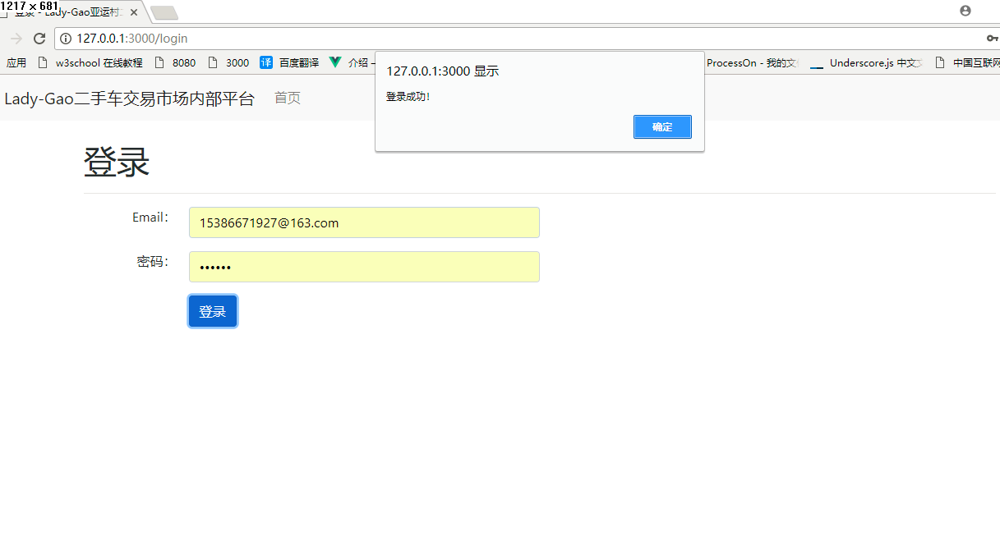
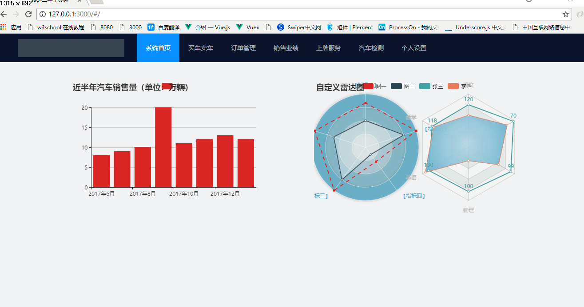
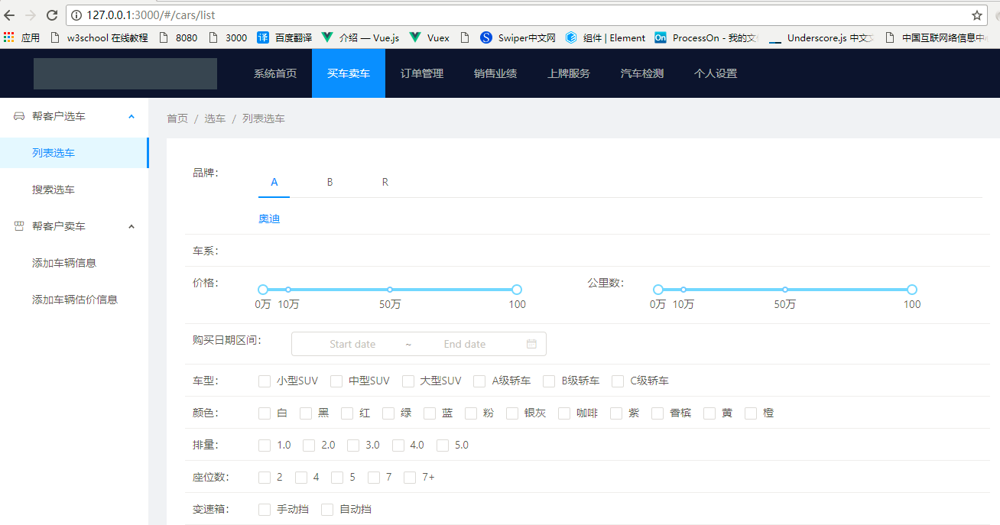
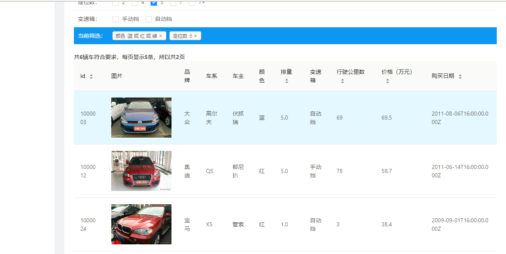
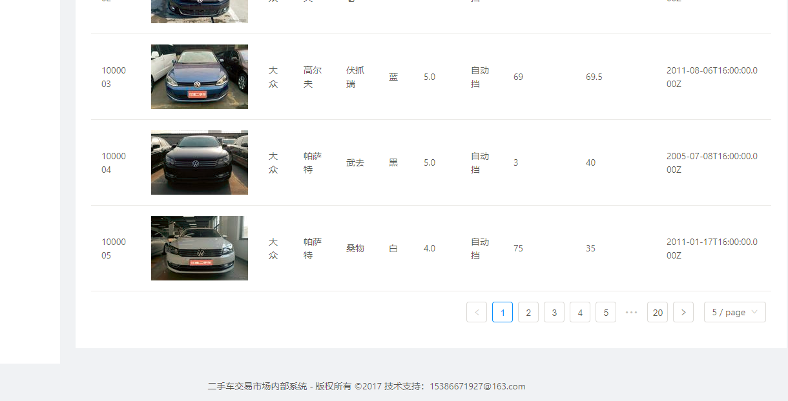

# Car

> A React.js project
## React+redux+jQuery+Dav+Echart+Webpack + Mongoose + Node

# install dependencies
npm install

# serve with hot reload at localhost:8080
npm run dev

node 模拟数据  项目链接本地数据库

